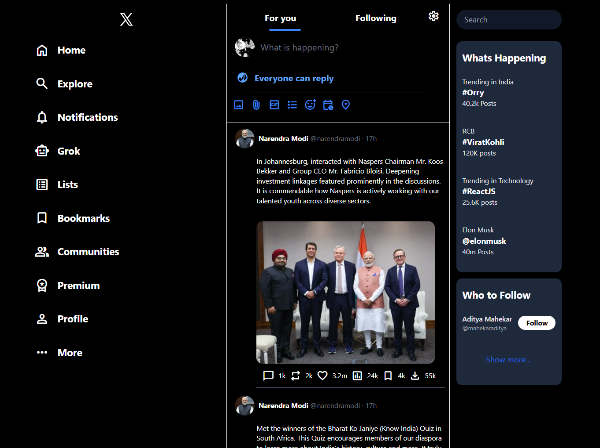

# 🐦 X (Twitter) Clone

A responsive front-end clone of **X (formerly Twitter)** built using **HTML, Tailwind CSS, and JavaScript**.  
This project focuses on UI/UX design and layout inspired by the real X platform.

---

## 📸 Preview

|Home page UI of the X (Twitter) Clone  | 
|-----------|
|  | 


---

## 🚀 Features

- Responsive Sidebar (Mobile + Desktop)
- Tweet / Post UI
- Trending Section
- Who to Follow Section
- Material Icons Integration
- Tailwind CSS Utility Styling

---

## 🛠️ Technologies Used

- HTML5
- Tailwind CSS
- JavaScript
- Google Material Icons

---

## 📁 Project Structure

Twiiter/
│
├── css/
│ ├── input.css
│ └── output.css
│
├── imgg/
│ └── xc.png
│
├── index.html
├── package.json
├── tailwind.config.js
└── postcss.config.js

## ""TALWIND CSS + NPM INSTALLATION AND RUN GUIDE

1) CHECK NODE AND NPM

```
node -v
npm -v
```
Download if not installed:
```
https://nodejs.org/
```
2) CREATE PROJECT FOLDER
```
mkdir tailwind-project
cd tailwind-project
```
3) INITIALIZE NPM
```
npm init -y
```
4) INSTALL TAILWIND CSS
```
npm install -D tailwindcss postcss autoprefixer
```
5) INIT TAILWIND CONFIG
```
npx tailwindcss init -p
```
6) CONFIGURE TAILWIND

notepad tailwind.config.js

Paste this:
```
module.exports = {
  content: ["./*.html"],
  theme: {
    extend: {},
  },
  plugins: [],
}
```
7) CREATE CSS FILE
```
mkdir css
cd css
echo @tailwind base; > input.css
echo @tailwind components; >> input.css
echo @tailwind utilities; >> input.css
cd ..
```
8) BUILD TAILWIND
```
npx tailwindcss -i ./css/input.css -o ./css/output.css --watch
```
9) LINK CSS IN HTML
```
<link rel="stylesheet" href="./css/output.css">
```
10) NPM RUN [Terminal 1]

```
npm run build
```

11) RUN PROJECT [Terminal 2]

Option 1:
```
start index.html
```
Option 2 (VS Code):
```
code .
```
Right click index.html and open with Live Server
"""
